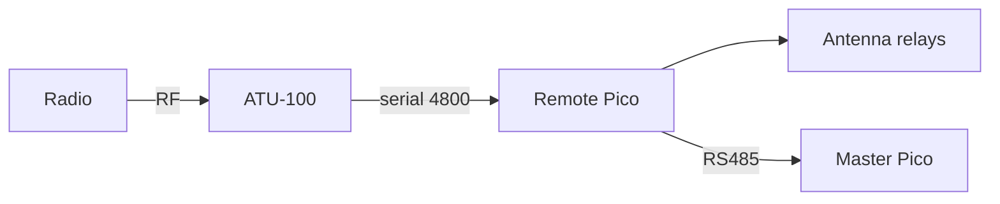

<div align="center">

# Antenna switch

Remote antenna switching and ATU-100 control on two Pico 2 W boards.

[](LICENSE.md)

</div>



## Features

- **One of four antennas.** The remote opens the current relay, waits, then closes at most one and reads the latch back.
- **Transmit interlock.** The remote refuses that change when a fresh Forward sample is above 1 W. The stock ukoda hex does not send Forward.
- **Keep the antenna if the master goes quiet.** Both displays show Communication Lost, and the selected relay stays closed.
- **Tuner text on both displays.** Power, SWR, L, and C follow the ATU-100 layout. At 1 W and above, with an efficiency reading, the last two lines switch to antenna power and percent.
- **Host tests with no hardware.** pytest runs the master and the remote against a fake ATU-100.

## Installation

Clone the tree, then install pytest for the host suite. Each Pico 2 W needs the MicroPython v1.29.0 UF2 for `RPI_PICO2_W`, dated 2026-08-24. Flashing uses [mpremote](https://docs.micropython.org/en/latest/reference/mpremote.html).

```bash
git clone https://github.com/sazlin/antenna-project.git
cd antenna-project
python3 -m pip install 'pytest>=7'
```

## Quick start

Wire both boards from [docs/WIRING.md](docs/WIRING.md) before you flash. Copy the UF2 with BOOTSEL held, then copy the tree. The board boots `/main.py`. The full steps are in [docs/FLASHING.md](docs/FLASHING.md).

```bash
# Flash the master after the UF2 is on the board.
mpremote cp -r common :
mpremote cp -r master :
mpremote cp master/main.py :main.py

# Flash the remote on the second Pico.
mpremote cp -r common :
mpremote cp -r remote :
mpremote cp remote/main.py :main.py

# Run the host suite. It needs no Pico, no RF, and no PIC programmer.
python3 -m pytest tests -q
```

The ATU-100 hex is not in this repository. Back up the PIC before you write a new image. Until the one-line diff in [atu100_firmware/README.md](atu100_firmware/README.md) is built and flashed, the interlock has no Forward sample and stays idle. The host does not compile that diff.

## Relay safety

Boot opens every relay before the watchdog starts, so a restart comes up with all relays open. Reset and F86 open them too. A latch readback fault opens them and does not restore the previous antenna.

The interlock ignores a Forward sample older than one second. It stays off when that sample is missing. Fallback mode has no power sample. Do not wire the fallback optocouplers and the tuner UART at the same time. [docs/ASSUMPTIONS.md](docs/ASSUMPTIONS.md) records that choice, and [docs/CUSTOMIZING.md](docs/CUSTOMIZING.md) shows where the 100 ms break-before-make wait lives.

## Documentation

- [Project guide](docs/README.md)
- [Wiring](docs/WIRING.md)
- [Flashing](docs/FLASHING.md)
- [Protocol](docs/PROTOCOL.md)

## Contributing

Report defects and questions in [issues](https://github.com/sazlin/antenna-project/issues). Redistribution needs written permission from the copyright holder.

## License

Proprietary, all rights reserved. See [LICENSE.md](LICENSE.md).
